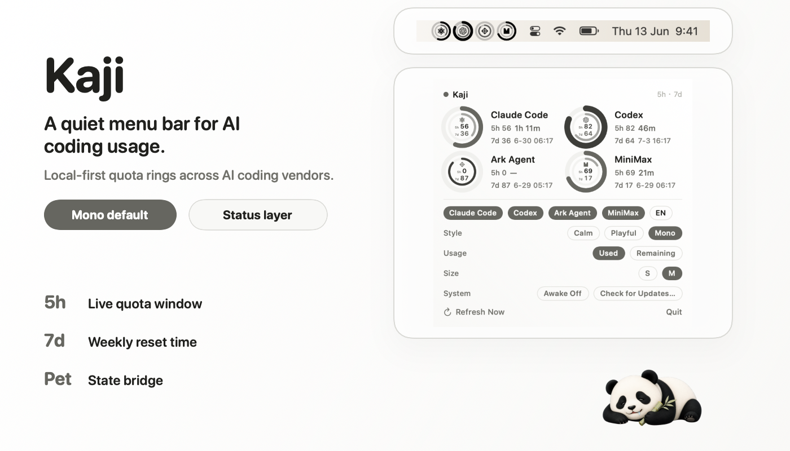

# Kaji
**A beautiful macOS menu bar for AI coding usage.** Kaji reads quota windows from multiple AI coding vendors and puts them in a quiet macOS menu bar signal. Kaji keeps your coding-agent quota visible before a long prompt hits a wall. It is local-first, native, and small enough to live beside Wi-Fi and battery. It currently supports macOS 13+ (Apple Silicon).

Kaji 会在长任务撞上额度墙之前提醒你。它本地优先、原生、轻，适合一直待在菜单栏里。 [中文](README.zh.md)

<p align="center"></p>

## Install
```sh
curl -fsSL https://raw.githubusercontent.com/MisterBrookT/kaji/main/install.sh | bash
```

Requires macOS 13+ on Apple Silicon. The installer downloads the latest release, moves Kaji into `/Applications`, stops old copies, and launches the app. Kaji is currently unsigned.

## What It Shows
- **Menu bar rings**: compact dual-ring status for selected providers.
- **Quota popover**: 5h usage, 7d usage, local reset time, provider toggles, refresh, updates, Keep Awake, and PetHatch pet controls.
- **Settings window**: slower preferences such as visual style, used/remaining mode, S/M size, EN/CN language, curated pet details, and pet selection.
- **Keep Awake**: optional macOS sleep-disable control for long agent runs and clamshell setups.
- **Pet launcher**: start/stop the selected PetHatch pet from the popover.
- **Three visual modes**: Mono is default; Calm adds blue-gray accents; Playful adds warmer accents.
- Pet runner is started with `--activity-source runtimeEvent` and consumes `pet-state.json` for quota-pressure aware behavior; it falls back to local timing if host state is stale.
- Kaji supports quick pet behavior modes by consuming generated `runtime.json`; use PetHatch helper profiles (`focus`/`balanced`/`marathon`) to tune rest thresholds and alert cadence.

## Quick links
- [pet bridge](docs/pet-bridge.md)
- [settings](Sources/Kaji/SettingsView.swift)

## License
MIT. See [LICENSE](LICENSE).
