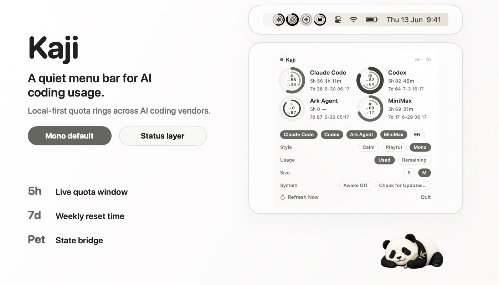
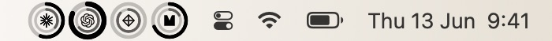
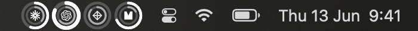
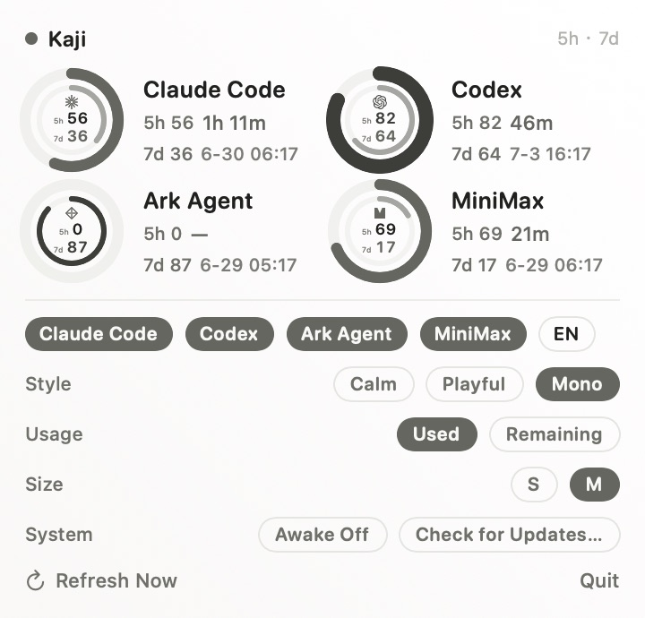
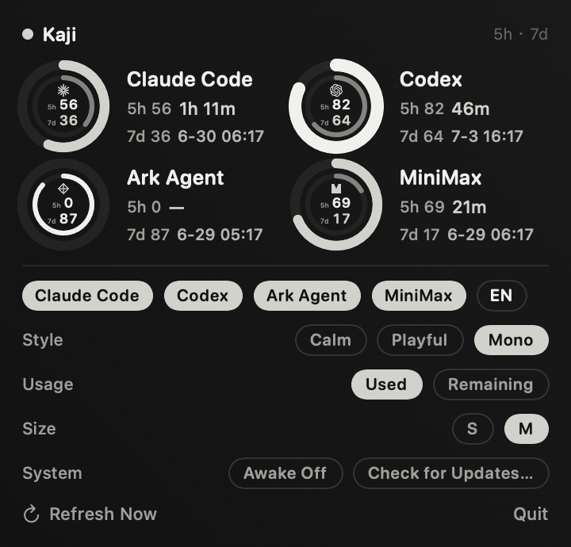

<div align="center">

<h1>
  
  <br />
  Kaji
</h1>

**A macOS menu bar command center for AI coding.**

Track Claude Code / Codex usage, watch token pressure, keep your Mac awake, manage focus breaks, and let Navi Panda block you when it is time to rest.

[中文](README.zh.md)

<a href="https://github.com/MisterBrookT/kaji/releases/latest"></a>
<a href="https://github.com/MisterBrookT/kaji/stargazers"></a>

<a href="LICENSE"></a>

<br />
<br />



</div>

## Why

AI coding agents are useful until quota, context, focus, or system pressure breaks the run. Kaji turns those hidden limits into one quiet menu bar surface.

No dashboard. No dock icon. One glance, then back to work.

## Name

`Kaji` comes from Japanese `舵 / かじ`: rudder, helm, the thing that keeps a ship on course. This app does the same for AI coding runs.

## Install

```sh
curl -fsSL https://raw.githubusercontent.com/MisterBrookT/kaji/main/install.sh | bash
```

Requires macOS 13+ on Apple Silicon. Kaji is currently unsigned; the installer removes quarantine and installs the latest release to `/Applications`.

## What Kaji Does

| Surface | What you get |
| --- | --- |
| **Quota** | 5h / 7d usage, reset timing, token trend, estimated cost, provider toggles |
| **Work / Break** | Focus timer, break timer, skip count, hard full-screen break overlay |
| **System** | CPU, memory, disk, top processes, one-click Auto Reclaim |
| **Goals** | Editable daily goals, reset, completion heatmap |
| **Pet** | Navi Panda, quota-aware 9-state animation, no message noise |
| **Keep Awake** | Optional macOS sleep prevention for long agent runs |

## Preview

<table>
  <tr>
    <td></td>
    <td></td>
  </tr>
  <tr>
    <td></td>
    <td></td>
  </tr>
</table>

## Navi Panda

Navi is not a chat widget. It is a small state layer for your coding session:

- `idle`: resting
- `running`: Codex / Claude usage is moving
- `waiting`: quota or input needs attention
- `review`: output is ready
- `failed`: something broke

Kaji writes local state to:

```text
~/Library/Application Support/Kaji/pet-state.json
```

PetHatch consumes this state and renders Navi with a 9-state atlas.

## Auto Reclaim

System cleanup is intentionally conservative:

- reclaim inactive memory when memory pressure is high
- clean selected Kaji / SwiftPM / developer caches when they are large
- terminate only safe Kaji-owned orphan processes

Kaji does not kill arbitrary dev servers.

## Build

```sh
swift run
./scripts/build-local.sh
```

Use `scripts/build-local.sh` for release-style local app bundles. It assembles `build/Kaji.app`, copies bundled resources, installs to `/Applications`, and can relaunch the app.

## Links

- [Pet bridge](docs/pet-bridge.md)
- [Design language](docs/design-language.md)
- [Latest release](https://github.com/MisterBrookT/kaji/releases/latest)

## License

MIT. See [LICENSE](LICENSE).
