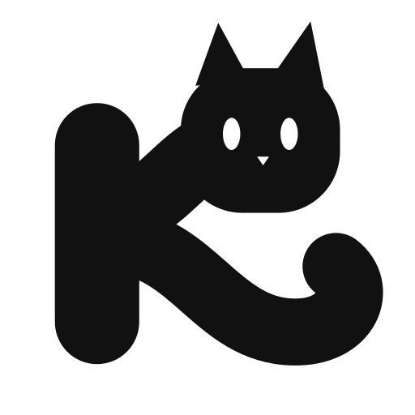
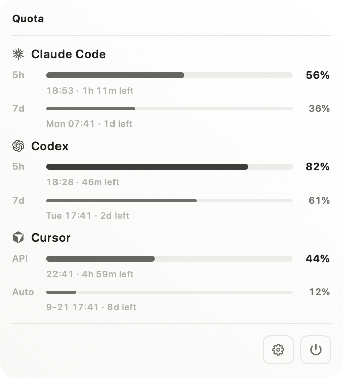

<div align="center">

<h1>
  <picture>
    <source media="(prefers-color-scheme: dark)" srcset="dev_docs/assets/kaji-cat-k-ondark.png">
    
  </picture>aji
</h1>

**AI coding quota, quietly in your menu bar.**

[中文](README.zh.md)



</div>

## Features

- **Quota:** usage percentages and reset times for your AI tools.
- **Work / Break:** optional focus timer and break reminders.
- **Goals:** optional daily and longer-term goals, with a CLI for agents.

Only quota is on by default. Turn off what you don't need. Black, white and gray, in light or dark mode.

## Privacy

- Reads local tool data and credentials; contacts providers directly for quota and token renewal.
- Prompts and goals stay on your Mac. No analytics, Kaji account, or Kaji server.
- Update checks and downloads use GitHub. You choose when to install updates.

[How quota works](docs/quota.md)

## Install

```sh
curl -fsSL https://raw.githubusercontent.com/MisterBrookT/kaji/main/install.sh | bash
```

[Requirements and troubleshooting](docs/faq.md) | [CLI](docs/cli.md)

## Contributing

Issues and PRs welcome. See [AGENTS.md](AGENTS.md).

[MIT](LICENSE). Not affiliated with the AI providers.
