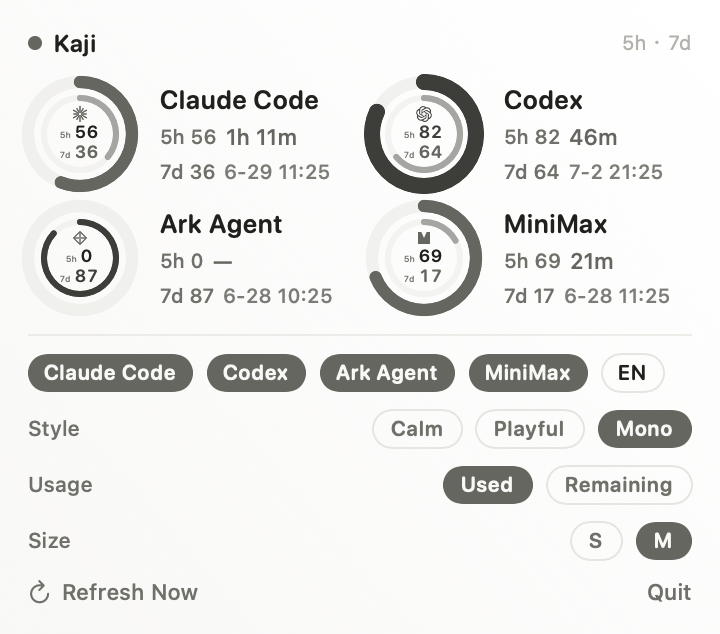
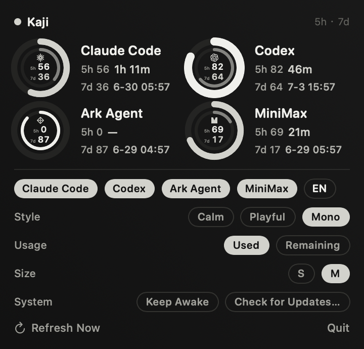

<div align="center">

<h1>
  
  <br />
  Kaji
</h1>

**给 AI Coding 用的 macOS 菜单栏状态管理器。**

看 Claude Code / Codex 用量，看 token 压力，看系统状态，管理工作节奏；该休息时，让 Navi 熊猫拦住你。

[English](README.md)

<a href="https://github.com/MisterBrookT/kaji/releases/latest"></a>
<a href="https://github.com/MisterBrookT/kaji/stargazers"></a>

<a href="LICENSE"></a>

<br />
<br />


</div>

## 为什么做

Coding agent 很好用，但额度、上下文、注意力、系统压力都会突然打断工作。Kaji 把这些隐藏限制收进一个安静的菜单栏界面。

没有 dashboard。没有 Dock 图标。看一眼，继续工作。

## 安装

```sh
curl -fsSL https://raw.githubusercontent.com/MisterBrookT/kaji/main/install.sh | bash
```

需要 macOS 13+ 和 Apple Silicon。Kaji 目前未签名；安装脚本会清除 quarantine，并把最新版安装到 `/Applications`。

## Kaji 能做什么

| 模块 | 能力 |
| --- | --- |
| **Quota** | 5h / 7d 用量、重置时间、token 趋势、估算成本、provider 显隐 |
| **Work / Break** | 专注计时、休息计时、跳过记录、强制全屏休息 |
| **System** | CPU、内存、磁盘、顶部进程、一个 Auto Reclaim 按钮 |
| **Goals** | 可编辑每日目标、重置、完成热力图 |
| **Pet** | Navi 熊猫、quota-aware 九态动画、默认无消息打扰 |
| **Keep Awake** | 长时间 agent 任务时阻止 macOS 休眠 |

## 预览

<table>
  <tr>
    <td></td>
    <td></td>
  </tr>
  <tr>
    <td></td>
    <td></td>
  </tr>
</table>

## Navi 熊猫

Navi 不是聊天组件。它是 coding session 的状态层：

- `idle`：休息
- `running`：Codex / Claude 用量在增长
- `waiting`：额度或输入需要注意
- `review`：输出待查看
- `failed`：任务失败

Kaji 写出本地状态：

```text
~/Library/Application Support/Kaji/pet-state.json
```

PetHatch 读取这个状态，用九态 atlas 渲染 Navi。

## Auto Reclaim

System 清理刻意保守：

- 内存压力高时回收 inactive memory
- Kaji / SwiftPM / developer cache 过大时清理
- 只终止安全的 Kaji-owned 孤儿进程

Kaji 不会杀任意 dev server。

## 构建

```sh
swift run
./scripts/build-local.sh
```

`scripts/build-local.sh` 会生成 `build/Kaji.app`，复制资源，安装到 `/Applications`，并可重新启动应用。

## 链接

- [桌宠桥接](docs/pet-bridge.md)
- [设计语言](docs/design-language.md)
- [最新 Release](https://github.com/MisterBrookT/kaji/releases/latest)

## License

MIT. 见 [LICENSE](LICENSE)。
