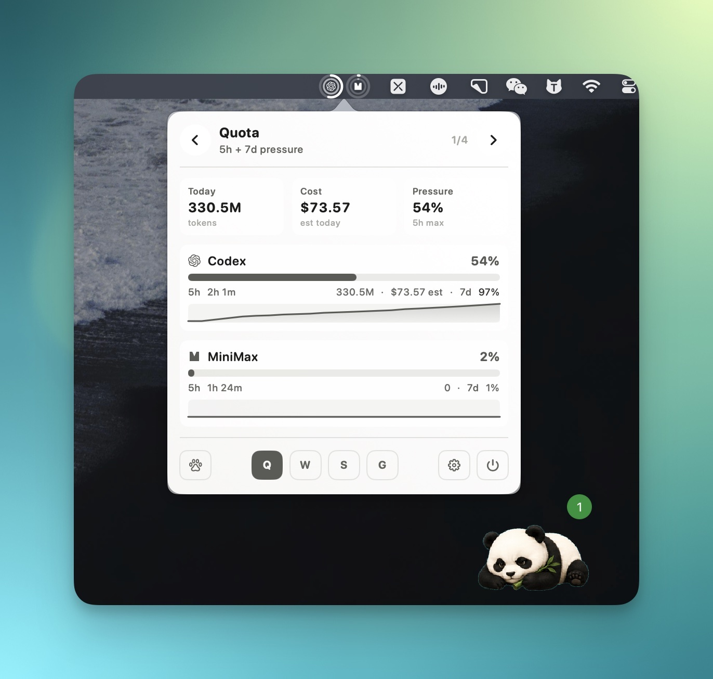

<div align="center">

<h1>
  
  <br />
  Kaji
</h1>

**可裁剪的 macOS 菜单栏：给 AI Coding 用。**

默认只有额度环。Work/Break、System、Goals 是可选模块——自己组装，保持安静。

[English](README.md)

<a href="https://github.com/blackblue-labs/kaji/stargazers"></a>

<a href="LICENSE"></a>

<br />
<br />



</div>

## 为什么做

Coding agent 很好用，但额度、上下文、注意力、系统压力都会突然打断工作。Kaji 把这些隐藏限制收进一个安静的菜单栏界面。

没有 dashboard。没有 Dock 图标。看一眼，继续工作。

## 名字

`Kaji` 来自日语 `舵 / かじ`，意思是舵、掌舵。它不是大仪表盘，而是让 AI coding 保持方向和节奏的小舵。

## 安装

```sh
curl -fsSL https://raw.githubusercontent.com/blackblue-labs/kaji/main/install.sh | bash
```

需要 macOS 13+、Apple Silicon，以及 `git` 与 `swift`。安装脚本会拉取最新 release tag、本机构建、清除 quarantine，并装到 `/Applications`。

我们**不**再提供可下载的 `.app.zip`（未签名 zip 容易被 Gatekeeper 拦）。Release 页上的 source archive 只适合阅读源码；要跑起来请用上面的安装命令，或 `./scripts/build-local.sh`。

见 [分发说明](dev_docs/ship/distribution.md)。

## Kaji 能做什么

默认安装只有 **Quota**。在 Settings 里打开其它模块。

| 模块 | 默认 | 能力 |
| --- | --- | --- |
| **Quota** | 开 | 5h / 7d 用量、重置时间、token 趋势、估算成本、provider 显隐 |
| **Work / Break** | 关 | 专注计时、菜单栏倒计时、休息遮罩 |
| **System** | 关 | CPU、内存、磁盘、顶部进程、Auto Reclaim |
| **Goals** | 关 | 可编辑每日目标、重置、完成热力图 |
| **Pet** | 桥接 | 经 `pet-state.json` 的 Navi 熊猫（不做第五个菜单栏主角） |
| **Keep Awake** | 设置项 | 长时间 agent 任务时阻止 macOS 休眠 |

## Navi 熊猫

Navi 不是聊天组件。它是 coding session 的状态层：

- `idle`：休息
- `running`：Codex / Claude 用量在增长
- `waiting`：额度或输入需要注意
- `review`：输出待查看
- `failed`：任务失败

Kaji 写出本地状态：

```text
~/Library/Application Support/Kaji/pet-state.json
```

PetHatch 读取这个状态，用九态 atlas 渲染 Navi。

## Auto Reclaim

System 清理刻意保守：

- 内存压力高时回收 inactive memory
- Kaji / SwiftPM / developer cache 过大时清理
- 只终止安全的 Kaji-owned 孤儿进程

Kaji 不会杀任意 dev server。

## Star History

<a href="https://www.star-history.com/?type=date&repos=MisterBrookT%2Fkaji">
 <picture>
   <source media="(prefers-color-scheme: dark)" srcset="https://api.star-history.com/chart?repos=blackblue-labs/kaji&type=date&theme=dark&legend=top-left" />
   <source media="(prefers-color-scheme: light)" srcset="https://api.star-history.com/chart?repos=blackblue-labs/kaji&type=date&legend=top-left" />
   
 </picture>
</a>

## 构建

```sh
swift run
./scripts/build-local.sh
```

`scripts/build-local.sh` 会生成 `build/Kaji.app`，复制资源，安装到 `/Applications`，并可重新启动应用。

## 链接

- [AGENTS.md](AGENTS.md) — 贡献者 / agent 方向
- 内部笔记：[dev_docs/README.md](dev_docs/README.md)

## License

MIT. 见 [LICENSE](LICENSE)。
