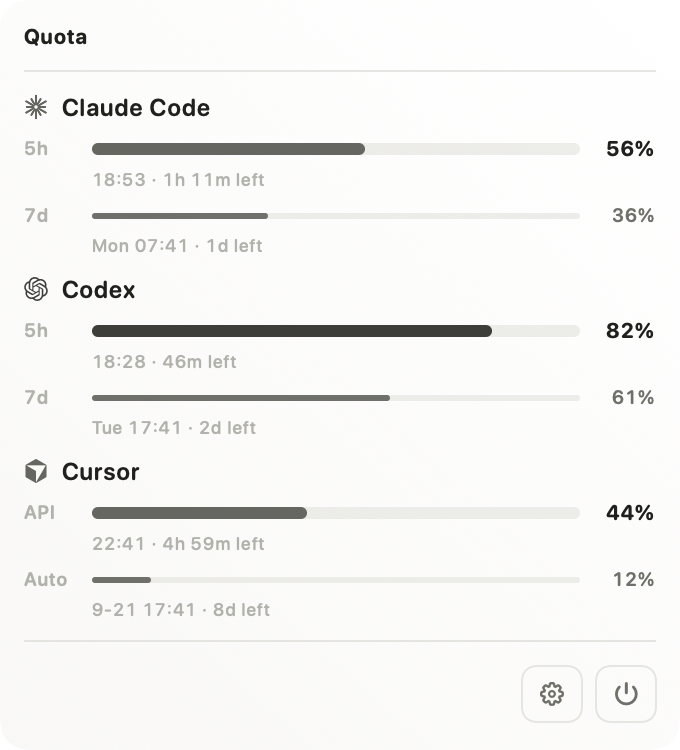
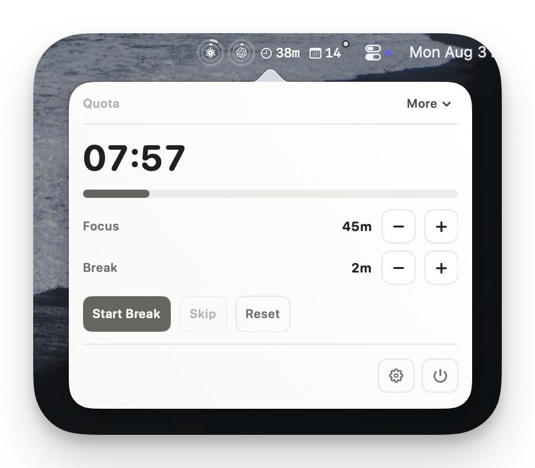
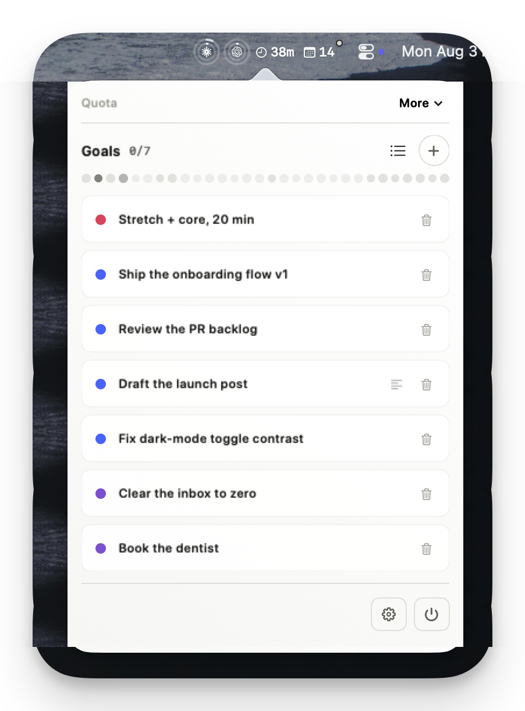

<div align="center">

<h1>
  <picture>
    <source media="(prefers-color-scheme: dark)" srcset="dev_docs/assets/kaji-cat-k-ondark.png">
    
  </picture>aji
</h1>

**值得一直留在菜单栏的 AI coding 状态层。**

Quota 一眼可见，其余能力按需拼装。

[English](README.md)

<a href="https://github.com/MisterBrookT/kaji/stargazers"></a>

<a href="LICENSE"></a>




</div>

## 是什么

Kaji 把真正在变化、又值得你随时知道的状态放进 **菜单栏**：Claude Code 与 Codex 还剩多少 quota、当前是否在专注块里、今天说过要做的事。

为什么是菜单栏？因为它始终在当前工作旁边：一眼知道状态，hover 获得上下文，点击立即操作。不需要切换 App，也不需要一条通知来打断你。

Kaji 默认很小：只开 Quota，其余模块按需开启。`Kaji` 来自日语 `舵 / かじ`。

## 三种实际用法

**1. 不用问，就知道 AI quota 还剩多少。** 每个 provider 的 5h 会话窗口与 7d 窗口，以及距离重置的时间（见上图）。环在菜单栏，数字点一下就有。

**2. 用专注块工作，而不是漂着过一天。** 菜单栏里能直接读的倒计时，以及真的会打断你的休息遮罩。



**3. 把今天的目标放在躲不开的地方。** Today / Week / Vision 三个层次，标签与说明，并提供 `kaji` CLI 让 agent 帮你增删与完成目标。



<details>
<summary>看动态演示（30 秒）</summary>

https://github.com/user-attachments/assets/a345bc3f-d74e-4092-8e8f-5730b154d39c

</details>

## 安装

```sh
curl -fsSL https://raw.githubusercontent.com/MisterBrookT/kaji/main/install.sh | bash
```

需要 macOS 13+（Apple Silicon）、`git`、`swift`（Xcode 或 Swift 工具链），以及可用的 `python3`。安装脚本会拉取最新 release tag、本机构建、装到 `/Applications`、清除 quarantine 并启动。

Release **不**附 `.app.zip`：目前还没有 Apple Developer ID 签名，浏览器下载的未签名 App 会被 Gatekeeper 拦住，本机构建反而是更诚实的路径。已 clone 的话执行 `./scripts/build-local.sh`。

出问题或想卸载：[常见问题与排查](docs/faq.md)。

## 模块

| 模块 | 默认 | 能力 |
| --- | --- | --- |
| **Quota** | 开 | 5h / 7d 用量、重置时间、各 provider 的环 |
| **Work / Break** | 关 | 专注计时、菜单栏倒计时、休息遮罩 |
| **System** | 关 | CPU / 内存、磁盘分类、顶部进程 |
| **Goals** | 关 | Today / Week / Vision / Schedule、说明、标签与热力图 |

关闭一个模块不只是隐藏页面，同时会停掉它的定时器与轮询。主题只有 **Mono**（黑白灰，浅色 / 深色）。

## 隐私

Kaji 读取 AI coding 工具本来就写在你 Mac 上的本地文件；对于只在服务端公布额度的 provider，则用你本机已有的凭据去调用该 provider 自己的用量接口。

- **本地读取：** `~/.claude/projects/**/*.jsonl`、`~/.codex/sessions/**/rollout-*.jsonl`，以及必要时的本地凭据（`~/.claude/.credentials.json`、Cursor 的 `state.vscdb`）。
- **离开本机的请求：** 启用 Claude 时访问 `api.anthropic.com`、启用 Cursor 时访问 `api2.cursor.sh`（只带你自己的 token），以及向 `api.github.com` 检查新版本。仅此而已，且只针对你启用的 provider。
- **没有统计、没有账号、没有我们的服务器。** 用量、prompt、目标都不会被上传。目标存在本地，CLI 只通过 `127.0.0.1` 与 App 通信。

每个数字具体怎么算：[quota 原理](docs/quota.md)。

## 文档

- [quota 原理](docs/quota.md)：数据来源、精度、provider、隐私
- [常见问题与排查](docs/faq.md)：python3 报错、quota 空白、卸载
- [CLI 参考](docs/cli.md)：在 shell 或 agent 里操作目标
- [产品原则](docs/product-principles.md) · [模块架构](docs/module-architecture.md) · [设计语言](docs/design-language.md)
- [AGENTS.md](AGENTS.md)：贡献者 / agent 笔记
- [最新 Release](https://github.com/MisterBrookT/kaji/releases/latest)

## 贡献

欢迎 issue 与 PR。提 PR 前请跑 `swift test`；UI 测试分层与布局不变量见 [AGENTS.md](AGENTS.md)。

## License

MIT，见 [LICENSE](LICENSE)。

与 Anthropic、OpenAI、Anysphere 及其他 provider 无隶属关系；相关名称与商标归各自所有者。
