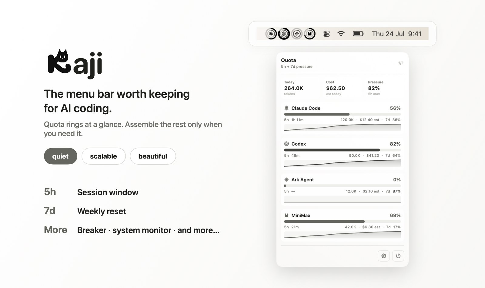
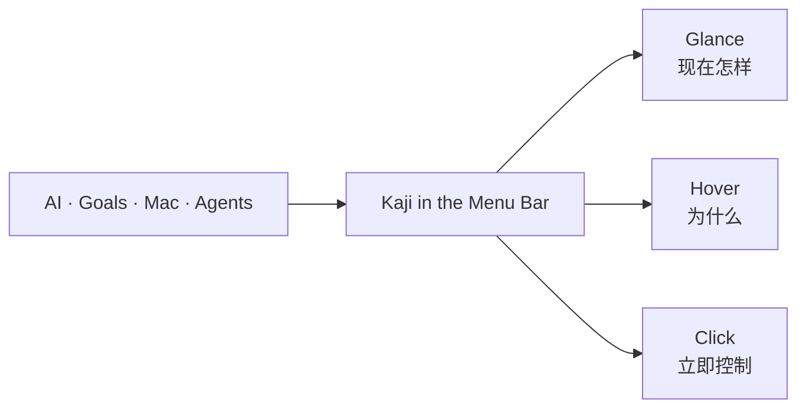
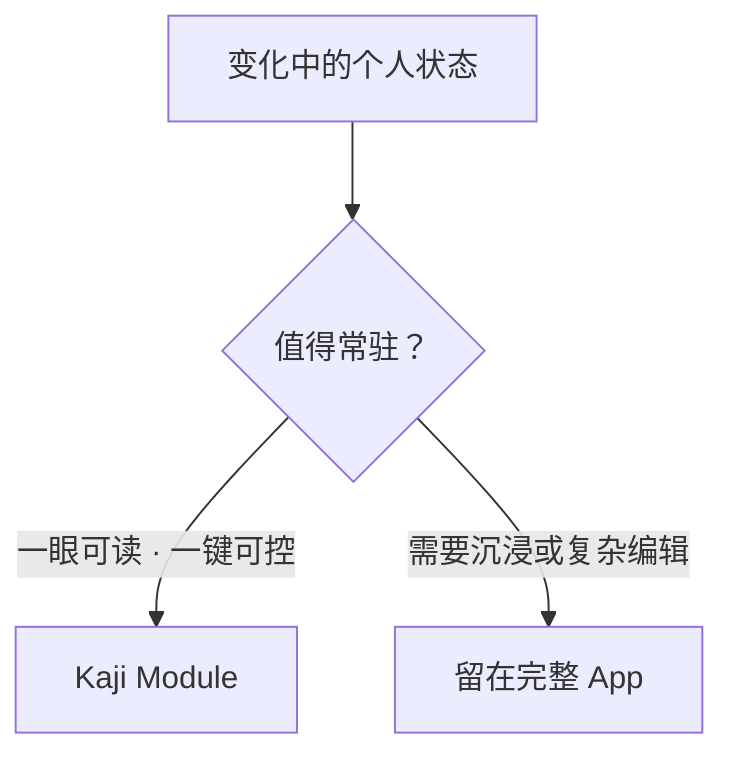

# Kaji Vision

> 状态：当前产品方向
> 更新：2026-08-05

## 离个人最近的一层

**Kaji 是 AI 时代 Mac 上离个人最近的状态与控制层。**

它关注一天中真正值得知道的动态。这些动态包括 AI quota、专注节奏、Goals、机器状态、AI News，以及未来运行中的 agents。它们被放到一个随时可见、一次动作即可抵达的位置。

## Why Menu Bar

Menu Bar 不是一个更小的 App window。它的价值恰恰是**不需要进入另一个 App**：

- 它始终在当前工作上下文旁边，不要求切换注意力。
- 一眼可以读取状态，一次 click 或 hover 可以获得下一层。
- 它适合持续变化但不值得主动打断用户的信号。
- 不需要时保持安静；关闭 module 后，入口与后台工作一起消失。

通知会打断人，完整 App 会让人离开当前工作。Kaji 位于两者之间：**ambient，但可操作**。

## 不是什么都放进来

Kaji 可以支持不同功能，但不是因为“Menu Bar 还能塞得下”。一个 module 值得进入 Kaji，需要回答：

1. 状态是否会在一天中变化？
2. 用户是否能在一眼内理解它？
3. 用户是否偶尔需要立即采取动作？
4. 为它打开一个完整 App 是否显得太重？

只有同时接近这些条件的能力，才属于 Kaji。

## 从工具到个人界面

Kaji 从 AI coding quota 起步，但 quota 只是第一种值得常驻的状态。

今天，Kaji 由可选的第一方 modules 组成。用户只开启自己需要的部分。未来，它可以容纳 AI News、后台 agent 活动等新的个人信号；也可能管理其它 menu-bar items，并让经过验证的 modules 按需安装。

这些是演进方向，不是为了“平台感”预先搭建市场。顺序始终是：

> 先证明一个状态值得离用户这么近，再把它做成 module。

替代单独的 menu-bar organizer 可以成为结果，但不是 Kaji 的全部身份。Kaji 管理的不只是图标，而是用户真正关心的活状态。

## 产品原则

- **Menu Bar first.** 核心价值必须在一眼、一 hover 或一次点击内成立。
- **Opt in.** 新 module 默认不强迫出现；用户决定自己的 Kaji。
- **Glance before detail.** 先给可信信号，再按需展开上下文。
- **Local and personal.** 优先本机状态，不把个人活动变成云端数据产品。
- **Quiet, not empty.** 安静是呈现方式；有用才是目的。
- **One shell, distinct modules.** 共享入口与视觉语言，但保留不同信息的自然表达。

## North Star

> **The personal status and control layer for an AI-native Mac.**

当 Kaji 做对时，用户不会觉得自己打开了另一个应用。他只是看了一眼 Menu Bar，就知道现在发生了什么，以及下一步是否需要做点什么。
